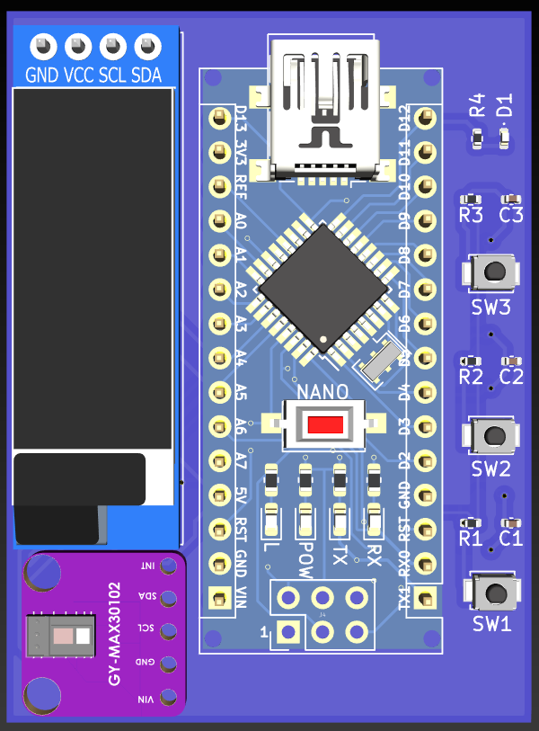
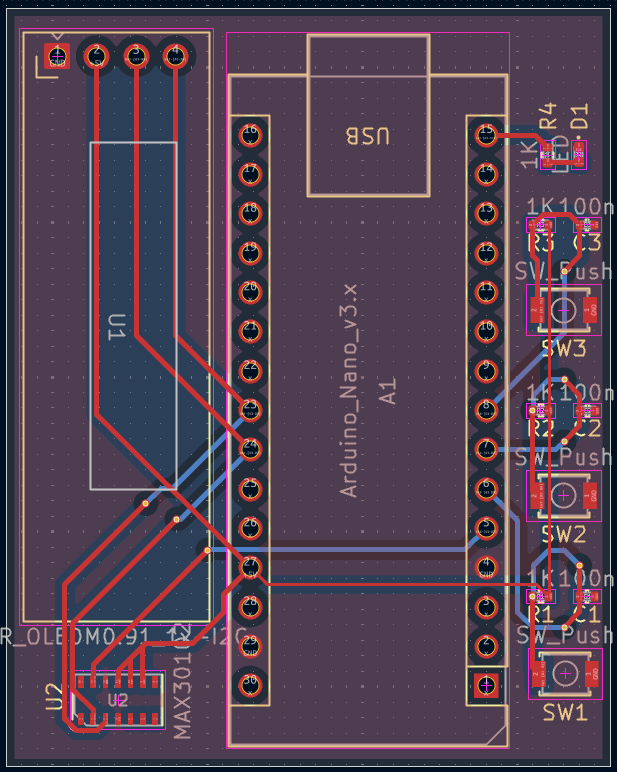
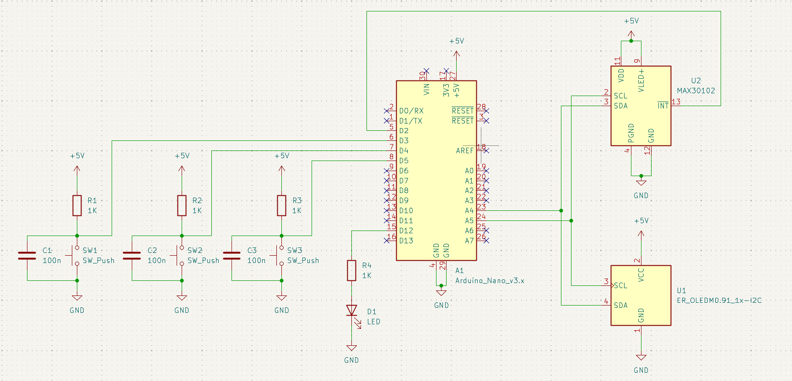

# ❤️ Heart Rate & Pulse Oximeter

> A custom PCB-based heart rate and pulse oximetry device built on an Arduino Nano with a MAX30102 optical sensor and a 0.91" OLED display, featuring three display modes and button-driven controls.


> ⚠️ **Note:** This project has been designed and assembled in simulation but has **not yet been physically tested**. Hardware validation and sensor calibration are pending.

---

## 📖 Overview

The **Heart Rate & Pulse Oximeter** is a wearable health monitoring device designed around a custom PCB. An Arduino Nano reads photoplethysmography (PPG) data from a MAX30102 optical sensor to calculate heart rate (BPM) via beat detection and estimate blood oxygen saturation (SpO₂) via a Red/IR ratio-of-ratios approximation. Results are displayed on a 0.91" SSD1306 OLED across three switchable display modes. Three debounced push buttons allow the user to start/stop measurement, cycle display modes, and recalibrate the sensor — all managed without blocking delays using `millis()`.

---

## ✨ Features

- ❤️ **Heart rate measurement** — detects individual beats using the SparkFun `heartRate` library and averages the last 4 readings for stable BPM output
- 🩸 **SpO₂ estimation** — approximates blood oxygen saturation from the Red/IR ratio using an empirical formula
- 📺 **Three display modes** — BPM + SpO₂ readout, bar graph view, and raw IR/Red sensor data
- 🔘 **Three-button interface** — SW1 starts/stops measurement, SW2 cycles display modes, SW3 triggers recalibration
- 💡 **LED blink indicator** — onboard LED blinks at 0.5 Hz while a measurement is active
- 🖐️ **Finger detection** — shows "No Finger" prompt on screen when IR value falls below threshold
- 🧠 **Memory optimised** — uses `F()` macro throughout to store strings in flash, keeping SRAM free on the Nano
- 🖥️ **Serial monitoring** — streams debug output at 115200 baud

---

## 🛠️ Hardware Components

| Component | Quantity |
|-----------|----------|
| Arduino Nano v3 | 1 |
| MAX30102 Pulse Oximeter Sensor (GY-MAX30102) | 1 |
| 0.91" SSD1306 OLED Display (I2C, 128×32) | 1 |
| Push Button (SW_Push) | 3 |
| Resistor 1K | 4 |
| Capacitor 100nF | 3 |
| LED | 1 |
| Custom PCB | 1 |

---

## 🔌 Pin Connections

| Component | Pin | Arduino Nano Pin |
|-----------|-----|-----------------|
| MAX30102 | VIN | 5V |
| MAX30102 | GND | GND |
| MAX30102 | SDA | A4 |
| MAX30102 | SCL | A5 |
| OLED (I2C) | VCC | 5V |
| OLED (I2C) | GND | GND |
| OLED (I2C) | SDA | A4 |
| OLED (I2C) | SCL | A5 |
| SW1 (Start/Stop) | Signal | Digital 3 |
| SW2 (Mode) | Signal | Digital 4 |
| SW3 (Recalibrate) | Signal | Digital 5 |
| LED indicator | Anode | Digital 12 |

> Both the MAX30102 and OLED share the I2C bus (SDA/SCL). The OLED is at address `0x3C`.

---

## 📐 PCB Design

This project uses a **custom KiCad PCB** with all components integrated onto a single board alongside the Arduino Nano.

**3D View:**



**PCB Layout:**



**Schematic:**



Gerber files for PCB fabrication are included in `Heart_Rate_And_Pulse_Oximeter_Gerber.zip`.

---

## 🚀 Getting Started

### Prerequisites

Install these libraries via Arduino IDE Library Manager (`Sketch → Include Library → Manage Libraries`):

| Library | Install Name |
|---------|-------------|
| Adafruit GFX | `Adafruit GFX Library` |
| Adafruit SSD1306 | `Adafruit SSD1306` |
| SparkFun MAX3010x | `SparkFun MAX3010x Pulse and Proximity Sensor Library` |

### Installation

1. **Clone the repository**

```bash
git clone https://github.com/deep-chatterjee/Heart-Rate-And-Pulse-Oximeter.git
cd Heart-Rate-And-Pulse-Oximeter
```

2. **Open the sketch**

   - Open `Heart_Rate_And_Pulse_Oximeter_Code.ino` in the Arduino IDE
   - Select your board: **Arduino Nano**
   - Select processor: **ATmega328P (Old Bootloader)** if needed
   - Select the correct **COM port**

3. **Upload and run**

   - Click **Upload**
   - Open **Serial Monitor** at **115200 baud** to see sensor initialisation messages and debug output

---

## 💻 How It Works

```
Place finger on MAX30102 sensor
              ↓
Reads IR and Red light values over I2C
              ↓
      IR value > 50,000?
        ↙           ↘
      YES             NO
       ↓               ↓
Beat detected?     Display "No Finger"
       ↓
Calculate instantaneous BPM
Average last 4 readings → beatAvg
       ↓
Estimate SpO₂ = 110 - (25 × Red/IR ratio)
       ↓
         Display based on mode:
  ┌──────────┬────────────┬───────────┐
  │  Mode 0  │   Mode 1   │  Mode 2   │
  │ BPM+SpO₂ │  Bar Graph │ Raw Data  │
  └──────────┴────────────┴───────────┘
```

---

## 🔘 Button Reference

| Button | Function |
|--------|----------|
| **SW1** | Toggle measurement ON / OFF |
| **SW2** | Cycle through display modes (BPM+SpO₂ → Graph → Raw Data) |
| **SW3** | Stop measurement and recalibrate sensor |

---

## ⚠️ SpO₂ Accuracy Note

The SpO₂ calculation in this project uses a **simplified ratio-of-ratios approximation**:

```
SpO₂ ≈ 110 - (25 × Red/IR)
```

This is a rough empirical estimate intended for demonstration purposes. Clinically accurate SpO₂ requires AC/DC component separation over time with a properly characterised sensor. **Do not use this device for medical diagnosis.**

---

## 📁 Project Structure

```
Heart-Rate-And-Pulse-Oximeter/
├── Heart_Rate_And_Pulse_Oximeter_Code.ino       # Arduino sketch
├── Heart_Rate_And_Pulse_Oximeter_Schematic.png  # KiCad schematic
├── Heart_Rate_And_Pulse_Oximeter_PCB_View.png   # KiCad PCB layout
├── Heart_Rate_And_Pulse_Oximeter_3D.png         # KiCad 3D render
├── Heart_Rate_And_Pulse_Oximeter_Gerber.zip     # Gerber files for fabrication
└── README.md
```

---

## 🧠 What I Learned

- Reading PPG (photoplethysmography) data from the MAX30102 over I2C at 400 kHz fast mode
- Implementing rolling average beat detection using the SparkFun `heartRate` library
- Deriving a simplified SpO₂ estimate from the Red/IR signal ratio
- Designing a multi-mode OLED UI with debounced button controls using `millis()`
- Optimising Arduino Nano SRAM usage with the `F()` macro for string literals
- Designing a custom PCB in KiCad, including schematic capture, PCB layout, and Gerber export

---

## 🔮 Future Improvements

- Physically test and validate the PCB, and calibrate SpO₂ against a certified pulse oximeter
- Implement proper AC/DC ratio-of-ratios SpO₂ calculation using the full SparkFun algorithm
- Add a waveform display to visualise the live PPG pulse on the OLED
- Log readings to an SD card or transmit wirelessly via Bluetooth (HC-05) or BLE
- Add a low-power sleep mode to extend battery life between measurements
- Design an enclosure for the PCB

---

## 👤 Author

**Deep Chatterjee**  
[GitHub](https://github.com/deep-chatterjee)

---

## 📄 License

This project is licensed under the MIT License — see [LICENSE](LICENSE) for details.
